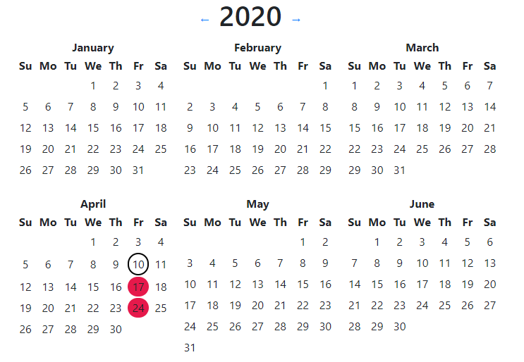

# [Demo](https://calendar.orchardroad.space/)

(This is a rewrite of the `Calendar` repository using Svelte; the demo above is still in React)

Simple calendar app to track day events (days you worked out, days you took your medicine etc.)

Click on the day to mark or unmark it.

Data is stored in `localStorage`.

You can keep different calendars by assigning `c` or `calendar` url parameter to some value, e.g.
`/?c=gym`.
